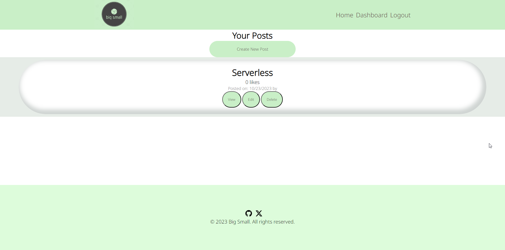

# Big Small

## Description
Big Small is a tech blog application built using Node.js and Handlebars. It provides users with the ability to create posts, view posts, and comment on other people's posts, making it an engaging platform for tech enthusiasts and bloggers.

## Features
- Create and publish tech blog posts.
- View posts from other users.
- Leave comments on posts to foster discussions.
- User-friendly interface powered by Handlebars.

## Screenshots
Here are a few screenshots to give you a visual preview of the Big Small Tech Blog:

- Home Page:
  

- All Posts:
  

- Post Creation:
  

- Post Viewing and comment section:
  

- Post Edit:
  

- User Dashboard:
  

## Deployment
You can access the live deployment of Big Small Tech Blog at the following URL:
[Big Small Tech Blog - Live Demo]()

## Getting Started
1. Clone the repository.
2. Install the required dependencies using `npm install`.
3. Set up your database and configure your database connection in `db/schema.sql`. Configure secret in `.env`.
4. Run the application with `npm start`.
5. Access the blog in your browser at `http://localhost:3001`.

## Contributing
We welcome contributions to make Big Small even better. Feel free to submit issues or pull requests on our [GitHub repository](https://github.com/ntandoyenkosi1/big-small-blog).

Thank you for using Big Small! Happy blogging and tech discussions!